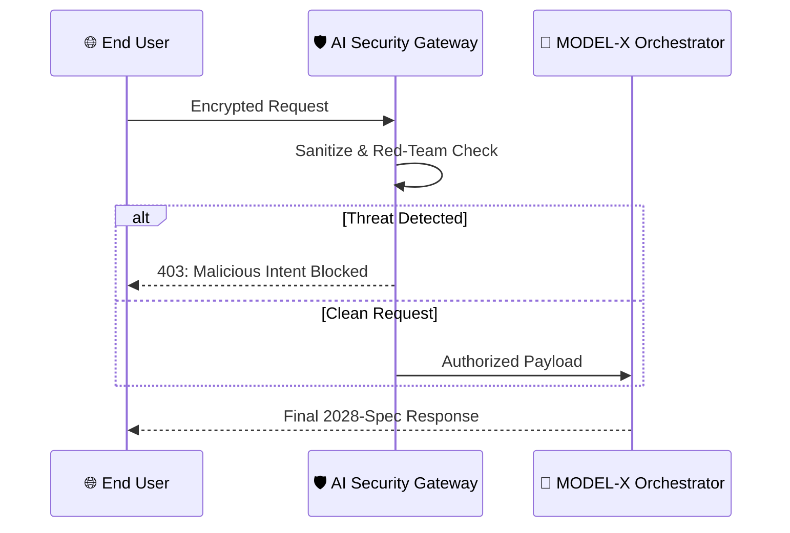

  

### *The 2028-Ready AI Architecture & Security Framework*

<video src="YOUR_15_SEC_MAIN_DEMO_URL_HERE.mp4" width="100%" autoplay loop muted playsinline></video>
  
<i>Real-time Neural Processing & Security Protocol Initiation</i>

[✨ Try the Live Demo](YOUR_DEPLOYMENT_LINK) • [📚 Read the Docs](YOUR_WIKI_LINK) • [🛡️ Report Bug](YOUR_ISSUES_LINK)

## 🚀 The Vision: Next-Gen AI
As the tech landscape accelerates toward 2028, legacy AI models are vulnerable and inefficient. **MODEL-X** is engineered to bridge the gap between high-performance ML architecture and impenetrable AI security. It autonomously sanitizes inputs and optimizes neural inference right at the edge.

### 🔥 Key Innovations
* **Autonomous Red Teaming:** A self-healing architecture that patches prompt injection vulnerabilities and isolates threats in real-time.
* **Agentic Orchestration:** Dynamically routes complex queries to specialized sub-models for optimized, low-latency compute.
* **Zero-Latency Inference:** Fully quantized pipeline ensuring split-second response times without sacrificing data privacy.

---

## 🎬 Core Features & Logic Flow

### 1. The Intelligence Core (ML Architecture)
Instead of relying on a single monolithic model, the orchestrator divides and conquers.

  <video src="YOUR_15_SEC_ML_LOGIC_URL_HERE.mp4" width="80%" autoplay loop muted playsinline style="border: 1px solid #444; border-radius: 8px;"></video>
  
<i>The system processing and routing a multi-layered reasoning query.</i>

### 2. The Defense Grid (AI Security Layer)
Security cannot be an afterthought; it must be the gateway. 

  <video src="YOUR_15_SEC_SECURITY_URL_HERE.mp4" width="80%" autoplay loop muted playsinline style="border: 1px solid #444; border-radius: 8px;"></video>
  
<i>Detecting, isolating, and neutralizing an adversarial prompt attack before inference.</i>

---

## ⚙️ System Architecture
To achieve sub-150ms latency while maintaining security, MODEL-X uses a zero-trust verification loop.

---

👥 The Architects
Engineered by 2nd-year Computer Science Engineering students at Pranveer Singh Institute of Technology (PSIT), strictly focused on architecting the high-performance domains of tomorrow.

<table align="center">
<tr>
<td align="center"><a href="https://github.com/anshxgaur"> <b>Ansh Gaur</b></a> Backend & ML Architect</td>
<td align="center"><a href="https://www.google.com/search?q=https://github.com/Ankit-Contri"> <b>Ankit</b></a> AI Security Specialist</td>
</tr>
</table>

Built with ❤️ at [HacXtreme]

 

 

