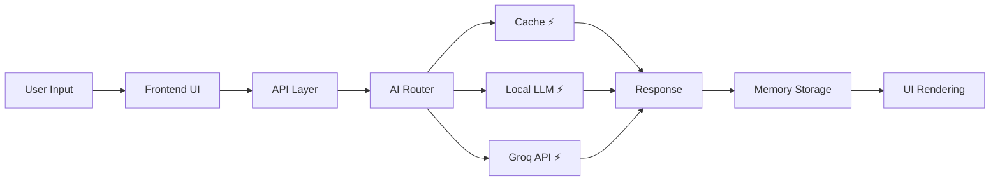
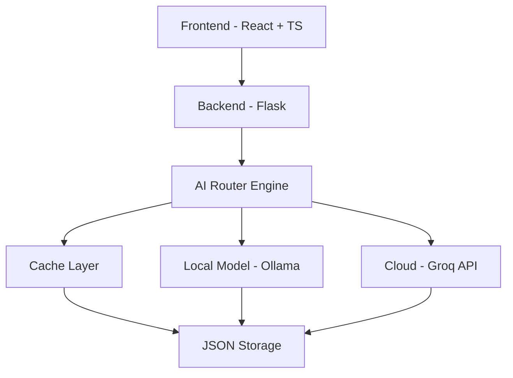

# 🌌 NOVA v2.0 — Autonomous AI Assistant

<div align="center">


### ⚡ Think • Remember • Act • Automate

> A real-time AI system with memory, voice control, and execution — built for speed, designed for the future.

🚀 **Hackathon Ready | Production-Grade | Blazing Fast**

</div>

---

## 📊 Performance Snapshot

<div align="center">

| Metric        | Value                               |
| ------------- | ----------------------------------- |
| ⚡ AI Speed    | **750+ tokens/sec (Groq LPU)**      |
| 🚀 UI Latency | **<100ms**                          |
| 🧠 Memory     | **500+ conversations stored**       |
| 🌍 Languages  | **15+ supported**                   |
| 🔒 Security   | **Enterprise-grade API protection** |

</div>

---

# 🎬 Demo Preview (Quick Look)

<div align="center">


</div>

> ⚡ A quick glance at NOVA in action (UI + speed + interaction)

---

# 🎯 Full Demonstrations

## 🧠 Demo 1 — Ultra-Fast AI Interaction

<div align="center">
  <video width="800" controls autoplay loop muted>
    <source src="YOUR_VIDEO_LINK_1.mp4" type="video/mp4">
  </video>
</div>

* Real-time streaming responses
* Sub-100ms latency
* Smooth futuristic UI

---

## 🎤 Demo 2 — Voice + Automation

<div align="center">
  <video width="800" controls autoplay loop muted>
    <source src="YOUR_VIDEO_LINK_2.mp4" type="video/mp4">
  </video>
</div>

* Voice → command execution
* Keyboard & mouse automation
* Instant feedback

---

## 🧠 Demo 3 — Memory & Context Awareness

<div align="center">
  <video width="800" controls autoplay loop muted>
    <source src="YOUR_VIDEO_LINK_3.mp4" type="video/mp4">
  </video>
</div>

* Persistent memory
* Context-aware responses
* Conversation tracking

---

# 🌟 Why NOVA Stands Out

<div align="center">

| Capability      | Typical AI    | NOVA                      |
| --------------- | ------------- | ------------------------- |
| ⚡ Speed         | 100–200 tok/s | **750+ tok/s**            |
| 🧠 Memory       | Stateless     | **Persistent Memory**     |
| 🎤 Voice        | Limited       | **Full Automation Layer** |
| 🔁 Intelligence | API-only      | **Hybrid AI Router**      |
| 🎯 Use Case     | Demo          | **Real Product**          |

</div>

---

# 🧠 Hackathon Value

* ⚡ High-performance AI (Groq LPU)
* 🧠 Persistent memory engine
* 🎤 Voice + execution layer
* 🔁 Smart routing (Cache → Local → Cloud)
* 📊 Analytics + context awareness
* 🛠️ Real-world usability

> 💡 Built as a **complete AI system**, not just a chatbot.

---

# 🔥 Core Features

## ⚡ Performance

* 750+ tokens/sec inference
* Real-time streaming
* Smart caching
* <100ms UI latency

## 🧠 Intelligence

* Persistent memory
* Context awareness
* Topic detection
* Smart summaries

## 🎤 Voice & Automation

* Speech-to-command
* Keyboard shortcuts
* Mouse control
* System automation

## 🎨 UI/UX

* Cyber-themed interface
* Smooth animations
* Responsive design
* Real-time feedback

## 🔐 Security

* API protection
* Type-safe system
* Secure communication
* No sensitive data leaks

---

# ⚙️ System Flow



---

# 🏗️ Architecture Overview



---

# 🤖 NOVA Core Engine

```
   [ USER ]
      ↓
  ┌───────────┐
  │ FRONTEND  │
  └────┬──────┘
       ↓
  ┌───────────┐
  │ API LAYER │
  └────┬──────┘
       ↓
  ┌───────────────┐
  │  AI ROUTER    │
  ├────┬────┬─────┤
  │Cache│Local│Cloud│
  └────┴────┴─────┘
       ↓
   RESPONSE ⚡
```

---

# 🚀 Quick Start

```bash
git clone https://github.com/anshxgaur/MODEL-X.git
cd MODEL-X

pip install -r requirements.txt
npm install

echo "GROQ_API_KEY=your_key" > .env
echo "VITE_GROQ_API_KEY=your_key" >> .env

python app.py
npm run dev
```

---

# 📁 Project Structure

```
MODEL-X/
├── app.py
├── src/
├── config/
├── public/
└── README.md
```

---

# 🔮 Future Roadmap

* 🤖 Autonomous AI agents
* 🧠 Vector DB memory
* 🌐 Browser automation
* 📱 Mobile app
* 🧩 Plugin ecosystem

---

# 🏆 Use Cases

| Domain           | Application         |
| ---------------- | ------------------- |
| 👨‍💻 Developers | Code generation     |
| 🎓 Students      | Learning assistant  |
| 💼 Professionals | Productivity        |
| 🎤 Accessibility | Voice computing     |
| 🧠 Research      | Knowledge retrieval |

---

# 🏁 Final Pitch

NOVA is not just an assistant.

It is a **real-time, memory-driven, voice-enabled AI system**
designed to redefine human-computer interaction.

⚡ Fast
🧠 Intelligent
🎤 Interactive
🔁 Adaptive

**Built in a hackathon. Ready for the real world.**

---

<div align="center">


⭐ Star this repo if it impressed you

</div>
